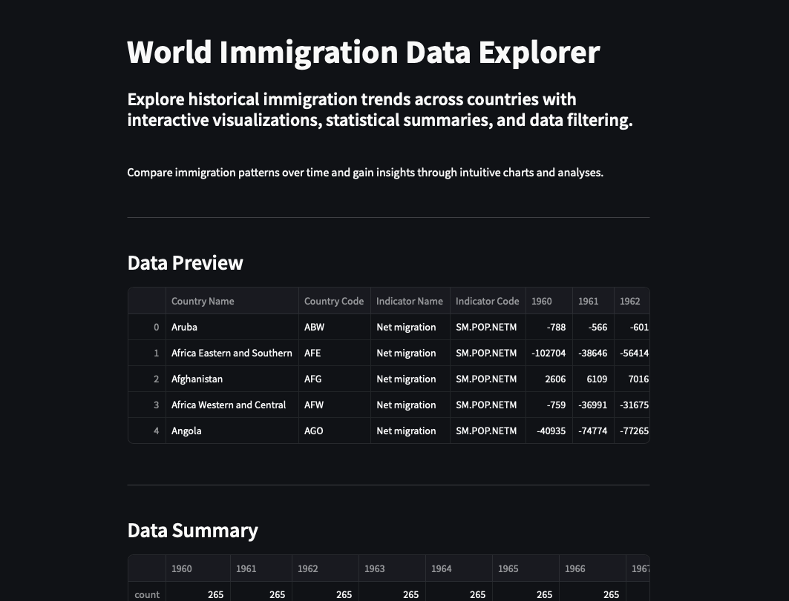
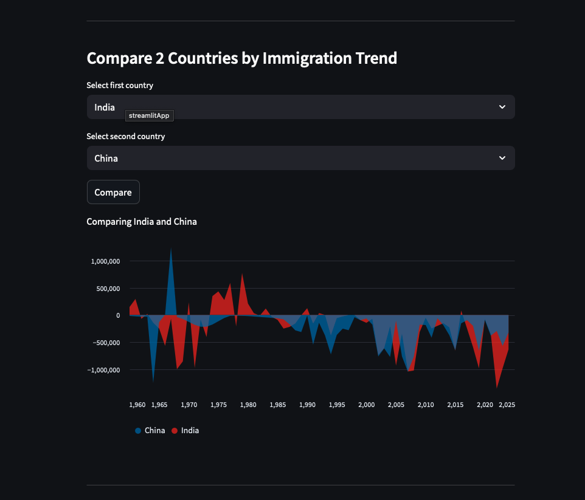
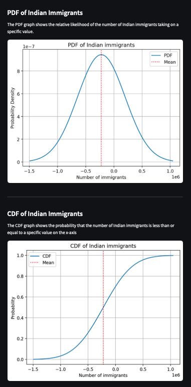

# 🌍 World Immigration Data Explorer

An interactive Streamlit web application to **explore**, **visualize**, and **analyze** historical immigration data from 1960 to 2024. This project provides insights into global migration trends by country using a clean, user-friendly interface.

👉 **[Launch the App →](https://global-immigration-dashboard.streamlit.app)**

---

## 📊 Features

* **Data Preview:** View the raw immigration dataset and descriptive statistics.
* **Country Comparison Tool:** Select any two countries to compare immigration trends from 1960 to 2024.
* **PDF & CDF Analysis:** Visualize the probability density and cumulative distribution for India's immigration statistics.
* **Top/Bottom Countries:** See which countries have the highest and lowest average immigration rates.
* **Custom Plotting:** Filter and plot any column from the dataset using dropdown controls.
* **Responsive Design:** Clean layout using Streamlit’s built-in components and interactive charts.

---

## 📷 Screenshots

### 🧽 Dashboard Overview



### 📈 Comparing Immigration Trends



### 📉 Statistical Analysis (PDF & CDF)



---

## 📁 Dataset

This app uses a pre-cleaned version of the **United Nations World Immigration Data**, with years from 1960 to 2024.
Ensure your CSV starts with country-level data, skipping the first 3 metadata rows.

---

## 🚀 Getting Started

1. **Clone this repo**

   ```bash
   git clone https://github.com/your-username/world-immigration-explorer.git
   cd world-immigration-explorer
   ```

2. **Install requirements**

   ```bash
   pip install -r requirements.txt
   ```

3. **Run the app**

   ```bash
   streamlit run app.py
   ```

4. **Upload or replace the `data.csv`** in the root directory with the correct format.

---

## 🛠 Technologies Used

* Python
* Streamlit
* Pandas
* Matplotlib
* NumPy
* SciPy

---

## 🔗 Live Demo

> Visit the live site here:
> 👉 <a href="https://global-immigration-dashboard.streamlit.app" target="_blank">global-immigration-dashboard.streamlit.app</a>
